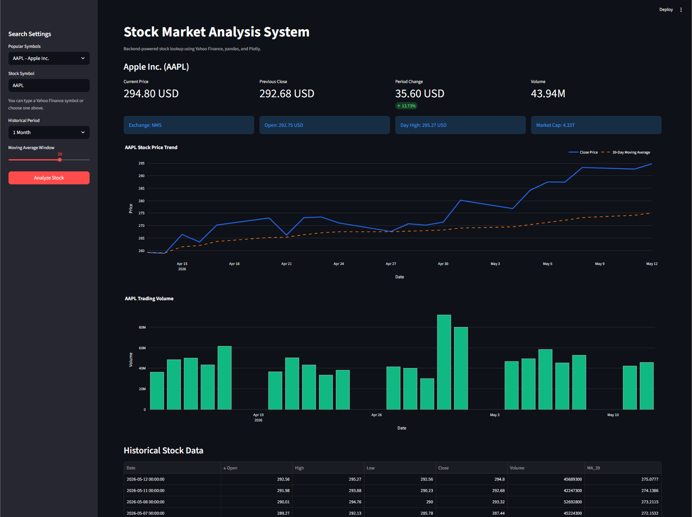
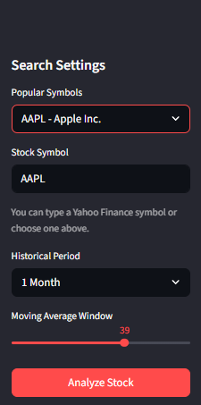
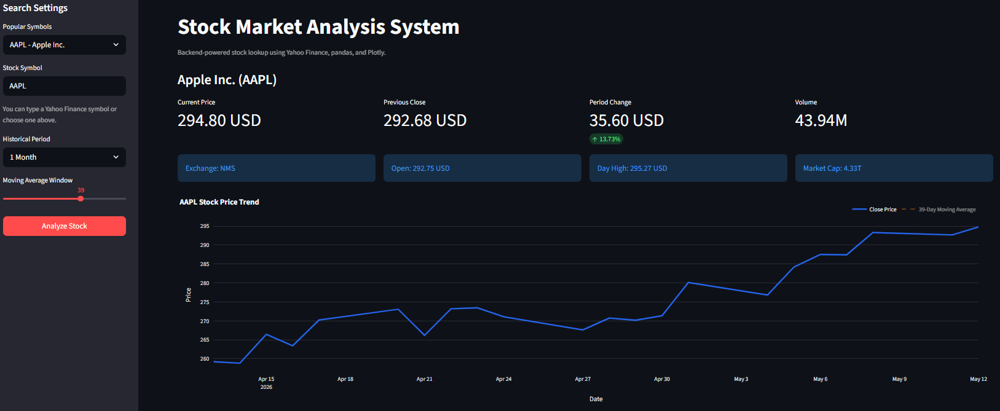
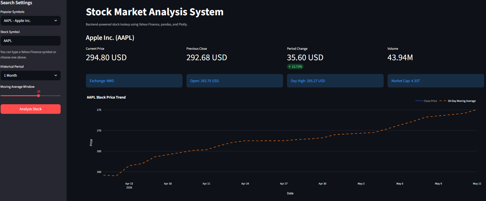
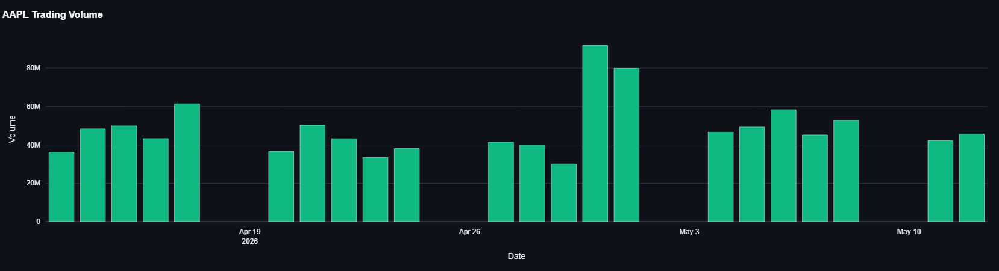
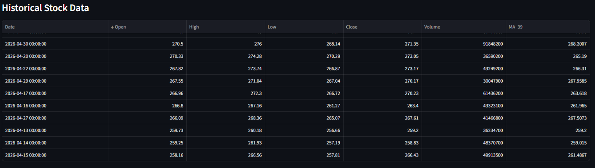
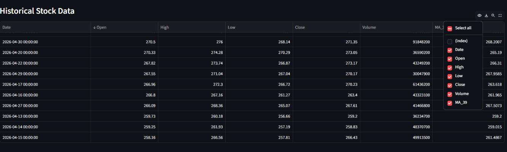

# 📈 Stock Market Analysis System

<div align="center">


### 📊 Interactive Stock Market Dashboard & Analysis Tool

Analyze stock market trends, visualize historical prices, and explore real-time financial data through an interactive Streamlit dashboard.

</div>

---

# ✨ Overview

The **Stock Market Analysis System** is a Python-based web application built using Streamlit that allows users to search and analyze stock market data using Yahoo Finance.

The application provides:

* Real-time stock information
* Historical stock analysis
* Interactive price visualizations
* Trading volume analysis
* Moving average calculations
* Smart validation & symbol suggestions

The project was designed using modular architecture principles for better scalability, maintainability, and clean backend separation.

---

# 🛠️ Tech Stack

| Category        | Technologies              |
| --------------- | ------------------------- |
| Language        | Python                    |
| Framework       | Streamlit                 |
| Data Processing | Pandas                    |
| Visualization   | Plotly                    |
| Stock API       | yFinance / Yahoo Finance  |
| Architecture    | Modular Backend Structure |

---

# 🚀 Core Features

## 📈 Real-Time Stock Analysis

* Fetch live stock information
* Display current price & previous close
* Market cap & trading volume metrics

## 📊 Historical Data Visualization

* Interactive stock trend charts
* Historical OHLCV analysis
* Dynamic time period selection

## 📉 Moving Average Analysis

* Configurable moving average window
* Trend smoothing visualization
* Improved market trend analysis

## 🔍 Smart Validation System

* Automatic uppercase normalization
* Invalid symbol handling
* Regex-based validation
* Smart symbol suggestions

## ⚡ Performance Optimization

* Streamlit caching implementation
* Reduced repeated API calls
* Faster dashboard loading

## ❌ Error Handling

* API failure management
* User-friendly error messages
* Invalid stock detection

---

# 🏗️ Project Structure

```text
StockMarketProject/
│
├── backend/
│   ├── stock_api.py
│   ├── validation.py
│   ├── data_processing.py
│
├── charts/
│   ├── charts.py
│
├── screenshots/
│
├── app.py
├── requirements.txt
├── README.md
```

---

# ⚙️ System Workflow

```text
User Input
   ↓
Validation Layer
   ↓
Yahoo Finance API
   ↓
Data Processing
   ↓
Plotly Visualization
   ↓
Streamlit Dashboard
```

---

# 📱 Application Preview

## 📊 Dashboard

|                   Main Dashboard                  |           Sidebar Controls          |
| :-----------------------------------------------: | :---------------------------------: |
|  |  |

---

## 📈 Price Trend Visualization

|                 Price Trend                 |                   Moving Average                  |
| :-----------------------------------------: | :-----------------------------------------------: |
|  |  |

---

## 📊 Volume Analysis

|                 Trading Volume                |
| :-------------------------------------------: |
|  |

---

## 📉 Historical Data & Metrics

|                    Historical Table                   |            Stock Metrics            |
| :---------------------------------------------------: | :---------------------------------: |
|  |  |

---

# ⚙️ Installation

## Prerequisites

* Python 3.11
* pip
* VS Code / PyCharm

---

## Clone Repository

```bash
git clone https://github.com/Ahmed1Atef1/stock-market-analysis-system.git
cd stock-market-analysis-system
```

---

## Install Dependencies

```bash
pip install -r requirements.txt
```

---

## Run Application

```bash
streamlit run app.py
```

---

# 📚 Key Concepts Used

* API Integration
* Data Validation
* Data Processing
* Interactive Visualization
* Exception Handling
* Modular Architecture
* Caching Optimization

---

# 🔮 Future Improvements

* AI-based stock prediction
* Portfolio management
* Live market updates
* Financial news integration
* Watchlist support
* User authentication system

---

# 👨‍💻 Developer

### Ahmed Atef

Backend Development • Data Processing • API Integration • Visualization

GitHub: https://github.com/Ahmed1Atef1

---

# 📄 License

This project is intended for educational and learning purposes.

---

<div align="center">

### 📈 Developed with Python & Streamlit

</div>
